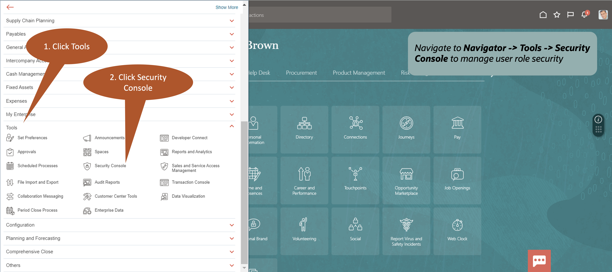
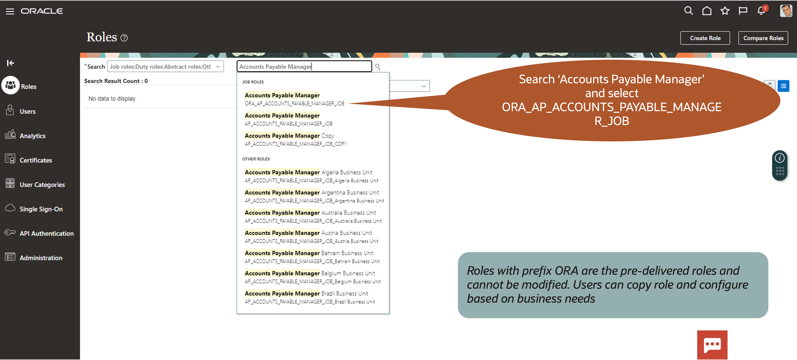
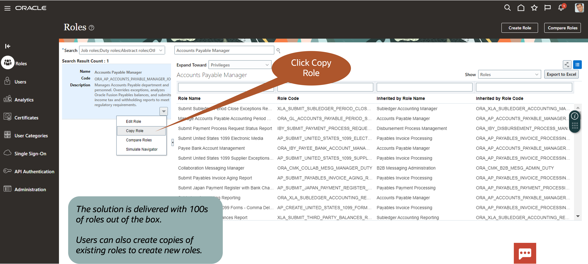

# Manage Application Security

## Introduction

In this lab, you are going to learn how to manage user security via role-based access controls. You'll learn how to create new roles by leveraging tools provided within the application. 

Estimated Time: 15 minutes

### Objectives

In this lab, you will:
* Manage Application Security

## Task 1: Navigate to Security Console

1.  After logging in, click on Navigator icon to display the menu options

    > From the **Home Page**, click the **Navigator** icon on the top left of the browser window.

    

2.  Navigate to Security Console to manage user role security

    > Scroll and Expand the **Tools** tab, and click on **Security Console** menu option.

    

3. Search for the pre-built existing role you like to copy.

    > To Search - type **Accounts Payable Manager** in the search bar, and then select the **ORA_AP_ACCOUNTS_PAYABLE_MANAGER_JOB** job role. 

    

4. Copy the role. You will have an option to copy the top level role or top level role with the inherited roles. 

    > Click on **‘Copy Role’** and then select **'Top Role Only'**.

    

5. Need Help? Choose Application Security Guide and follow the guided flow to complete the tasks. Same process and steps are used to configure roles for other functional pillars such as Supply Chain (SCM), Human Resources (HCM)

**You may now proceed to the next lab.**

## Acknowledgements
* **Author** - Sajid Saleem, Master Principal Cloud Technologist
* **Contributors** -  Sajid Saleem, Master Principal Cloud Technologist
* **Last Updated By/Date** - Sajid Saleem, June 2024
