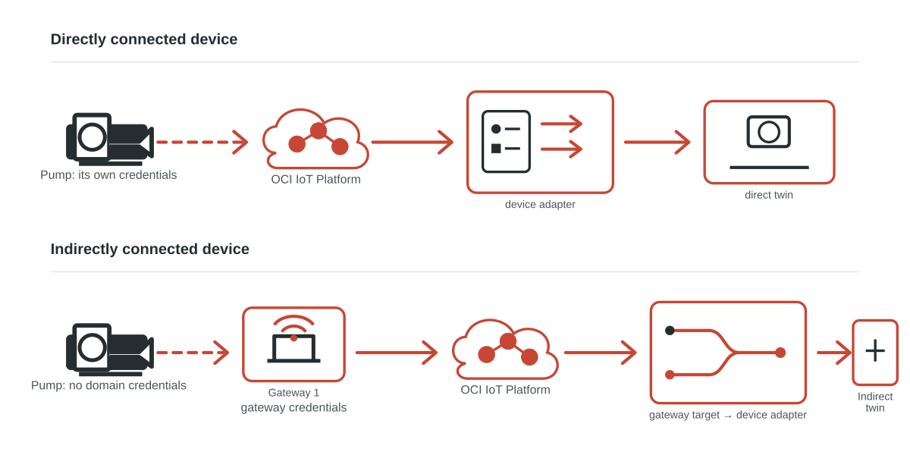
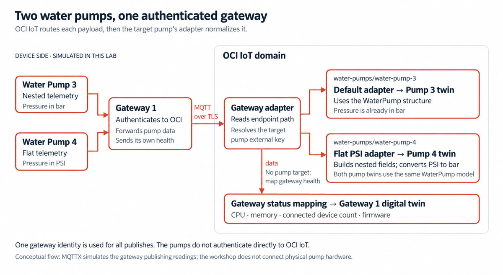

# Lab 1: Understand Gateways and Indirectly Connected Devices

## Introduction

Before you configure Gateway 1, compare OCI IoT connectivity patterns. A directly connected twin authenticates with the IoT domain and sends its own telemetry. An indirectly connected twin relies on an authenticated gateway to forward telemetry.

Estimated Time: 10 minutes

```quiz-config
badge: images/gateway-understanding-badge.svg
```

### Objectives

In this lab, you will:

- Distinguish direct connectivity from gateway-based indirect connectivity.
- Identify gateway, target-device, and adapter roles in the indirect path.
- Check your understanding before you configure the gateway.

### Prerequisites

- Complete the workshop introduction.

## Task 1: Compare direct and indirect connectivity

1. Review the topology. Both paths update a digital twin in OCI IoT Platform. Authentication and routing occur in different places.

    

2. In the **direct** path, the device connects with its own authentication ID and external key. When required, its adapter maps telemetry before OCI IoT updates the twin.

3. In the **indirect** path, the gateway faces the IoT domain. It authenticates to OCI IoT Platform and forwards data for one or more indirect devices. An indirect device has a gateway association instead of its own authentication ID.

    A gateway needs an authentication ID, just as a directly connected device does. Use a Vault secret or an mTLS certificate. For production deployments, use certificates.

4. The gateway adapter resolves the message target before it evaluates routes. When the target matches an associated indirect-device external key, OCI IoT sends the payload to that device's adapter. An empty or null target leaves the message with the gateway. Lab 2 creates the gateway model and routing adapter before Lab 3 creates the pumps.

    

5. In this workshop, the segment after `water-pumps/` identifies the target pump. Gateway health telemetry uses `data` and stays with Gateway 1. After routing, each pump can use an adapter that matches its payload shape.

## Task 2: Check your understanding

1. Answer each question, then review its explanation.

    ```quiz
    Q: Which component authenticates to OCI IoT Platform for telemetry from an indirectly connected water pump?
    - The indirectly connected pump, using its own authentication ID
    * The gateway that is associated with the pump
    - The WaterPump model
    - The pump's digital twin adapter
    > An indirect device has one or more gateway associations instead of its own authentication ID. The gateway authenticates and forwards its telemetry.

    Q: Which authentication mechanisms can an OCI IoT gateway use?
    * A Vault secret or an mTLS certificate; certificates are recommended for production.
    - Only a Vault secret because certificates are for directly connected devices.
    - Only an mTLS certificate because gateways cannot use secrets.
    - Credentials from each indirectly connected device.
    > A gateway can use a Vault secret or an mTLS certificate for its authentication ID. Use certificates for production deployments.

    Q: What does the gateway adapter target determine for a forwarded message?
    - Which gateway certificate OCI uses for the MQTT connection
    - Which WaterPump model definition is deleted after processing
    * Which associated indirect digital twin instance should receive the payload for its adapter to process
    - Whether the device must change to direct connectivity
    > The gateway resolves a target before it evaluates routes. When the target matches an associated indirect digital twin instance's external key, OCI IoT delegates the payload to that instance's adapter.

    Q: Why can the two indirect pumps in this workshop use different adapters?
    - A gateway can authenticate only one indirect device at a time
    - Each adapter creates a separate IoT domain
    * After the gateway routes a message to the correct indirectly connected pump digital twin, the adapter defined for that digital twin instance can normalize its particular payload shape
    - An indirectly connected device cannot use the same model as another device
    > Gateway routing selects the target indirectly connected digital twin instance. The adapter defined for that instance maps its payload to the shared WaterPump model, so the pumps can use different source formats.
    ```

    You may now **proceed to the next lab**.

## Learn More

- [Gateway and indirect-device scenario](https://docs.oracle.com/en-us/iaas/Content/internet-of-things/gateway-instance.htm)
- [Creating a digital twin instance](https://docs.oracle.com/en-us/iaas/Content/internet-of-things/create-digital-twin-instance.htm)
- [Digital twin adapters](https://docs.oracle.com/en-us/iaas/Content/internet-of-things/digital-twin-adapters.htm)

## Acknowledgements

* **Author** - Pete St. Pierre, Director, Product Management
* **Last Updated By/Date** - Pete St. Pierre, September 2026
